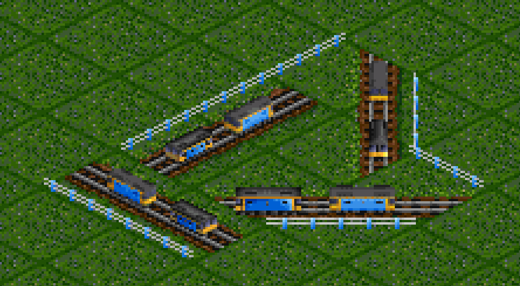
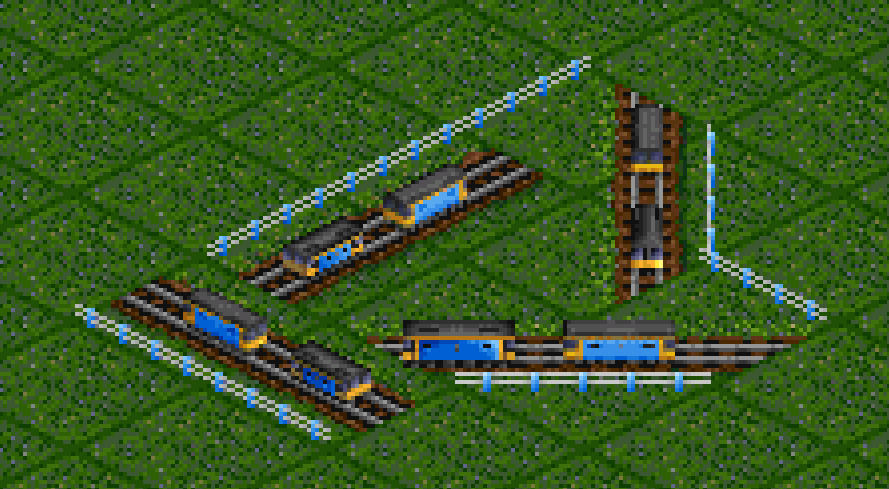
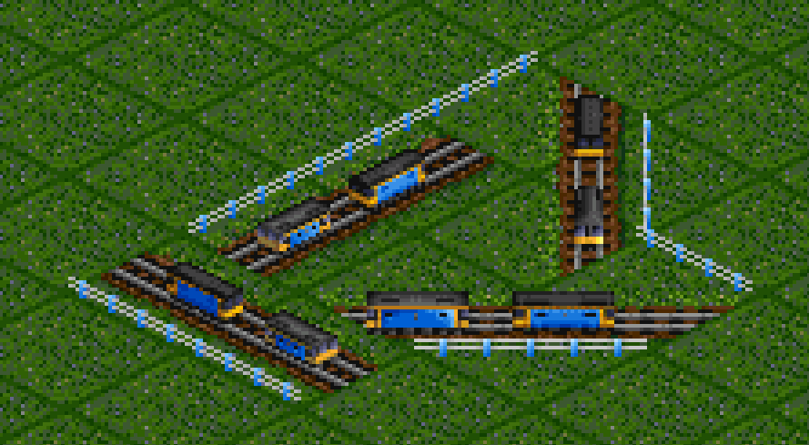
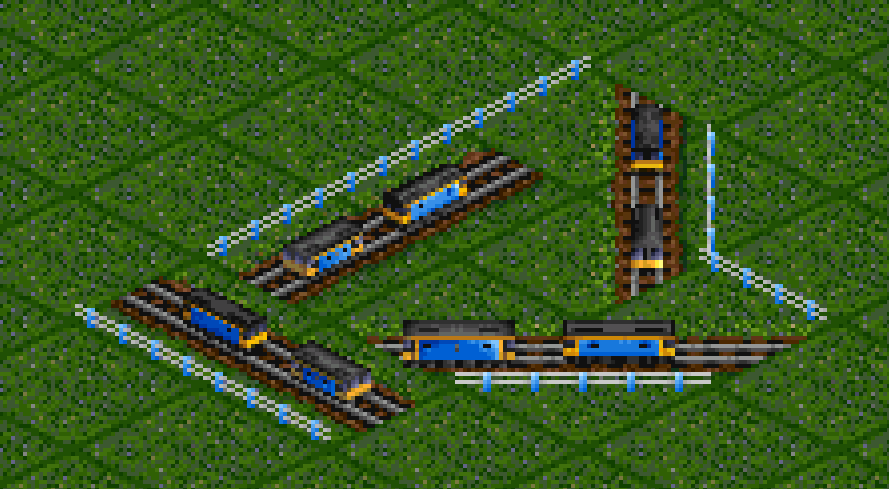
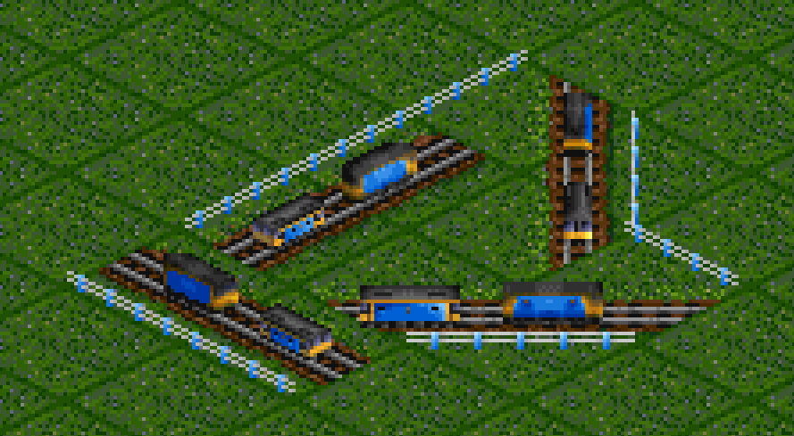
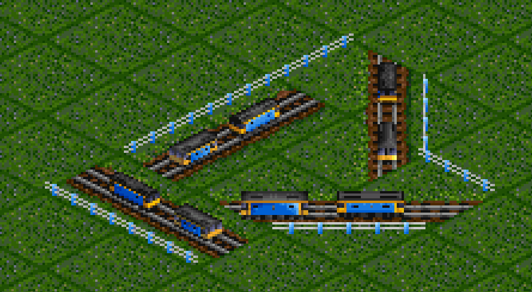
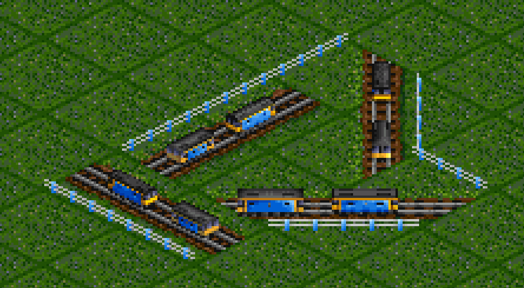

# Improving GoRender rendering

Rendering good sprites with GoRender is a challenge, especially at the
1x resolution where the difference between a good-looking sprite and a
horrible one can be as small as 2-3 pixels.

This repository takes you through starting with the default manifest
settings and a simple object, and tuning them until the output stands up
against the excellent Simon Foster artwork from Transport Tycoon.

The files from each step are in the `history` folder, so you can load
them in MagicaVoxel and/or your favourite text editor and follow the
changes.

## Setup

First step is to set the sizes to match the somewhat nonproportional original  
Foster-style graphics. The main differences are foreshortened sprites in the |
direction, and similarly squashed sprites in the -- direction.



We have two major noticeable issues - blurriness, and the roof shading not
matching the Foster originals. Let's start with the roof shading.

## Roof Shading

Adding some shading to the model gives us a small improvement, but it's
clear the bold lines and shading of the voxels are being toned down in
the rendering process. Time to see if we can play with the manifest.



The bluntest tool we have is the brightness and contrast settings. If
we get these right, the rest should be minor tweaking. Compared to the
Simon Foster sprite, it looks like we're currently too light and the contrast
is washed out. Let's change the default `0`/`0` settings to this:

```
"brightness": -0.05,
"contrast": 0.2,
```



Not quite perfect, but a lot closer. The increased contrast also makes the 
sprites a little grainier, reducing some of the visible blurriness.
We now see that our model is missing some of the finer shading of the 
original.

## Fine shading

There are two ways to improve shading in a GoRender object. You can either
accentuate the **shape** of something (making the lighting model more
responsive), or add **baked-in** shading directly to the model. I start
with the first option, and give the roof of my model a more aggressive curve.
I also tweak the body profile, making the cab ends slightly narrower to
give the lighting calculation a small ridge where it crosses to company
colour.


This is a big improvement. But we are seeing quite a lot of blurriness
around the vents, and a few stray pixels creeping in.

## Render settings

Most of GoRender's built-in manifests use the Poisson Disc sampler.
This is great for buildings and other objects with have a grainy, somewhat
noisy appearance in the original graphics - it avoids repeating artefacts
at the cost of adding the odd stray pixel.

For vehicles, it's sometimes better to use the square grid sampler, as
you want consistent artefacts rather than randomness. Changing to the
square grid immediately makes the sprites a lot more regular in
appearance:



We can see a slight problem here - the renderer is picking up the slightly
wider bodywork I created to give the lighting model something to work on.
We can deal with this in a moment, but there's another important setting
to play with first: `overlap`. This controls how much each pixel in the output
overlaps into sampling voxels from the surrounding pixels.

In general, high overlaps are softer at the cost of blurriness, wherease small
overlaps are sharper at the cost of graininess, noise and pixel artefacts.

Here, for example, is an overlap of `2`, an extreme setting:



Setting to negative values means the renderer will under-sample, concentrating
only on values near the centre of each pixel. If you are struggling with
small detail recovery, a slight negative overlap can help a lot. Here is the
output with an overlap of `-0.2`:



## Baked shading

Now that the output is getting close to the original graphics style, we can
start baking shading into the model, and putting in a few tweaks to make it
look right.

It's a good idea not to do this too early. Consider how much the output has
changed just from tweaks to the model shape and the rendering parameters; if
we'd baked shading into the model at the start, it would most likely be
completely wrong by now. But with things looking quite close to how we want
them, it's now safe to put effort into the model.

We are now very close to the original style (albeit with a few differences,
voxel rendering still has a way to go!)4



## Final tweaks

There's one last tweak we can play with - messing around with the lighting
direction. This is quite inconsistent in the original graphics, so don't feel
too guilty about moving the sun around 20-30 degrees one way or the other.

Another thing about the lighting is many of the original sprites are shaded
as if in "golden hour" lighting, with the sun at a very low angle. So while
you'd naturally think lighting elevation should be close to 90 degrees to
represent light being straight overhead, models will look more natural with
lighting elevation around 50 degrees or even lower.

Once you have the lighting in a good place, you'll occasionally notice
some weird lighting around corners, where GoRender is trying to figure out
what's happening with the lighting normals and getting confused by details.
In this case, making details flat can help. Another option, especially with
company colours, is forcibly using the darkest (or lightest) colour in a
range so GoRender isn't able to darken or lighten it any further.

Here's the final "Foster-style" output:


GoRender's output still isn't quite at the level of dedicated pixel art,
but these are a lot closer than the blurry mess we started with.

### General Tips

A couple of useful things to keep in mind:

* Avoid large flat surfaces with a single colour. They make the limitations
  of GoRender's lighting and dithering algorithms very obvious.
* Start with broad-brush settings like contrast and brightness, and work
  toward the subtle ones such as lighting or tweaking voxel shading.
* When starting a workflow for a particular type of object (e.g. buildings,
  road vehicles, trains), a good starting point is trying to get as close to
  one of the original Simon Foster sprites as you can, then using those
  settings to render the rest of your set.